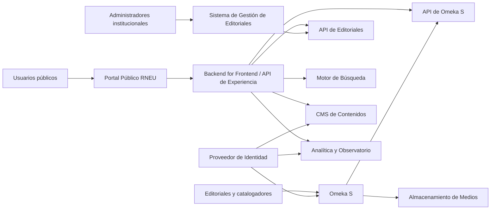
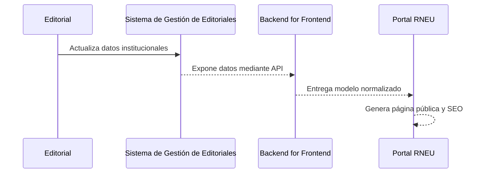
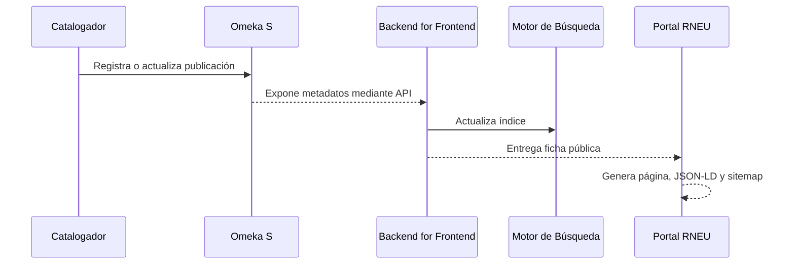

---
title: Application Landscape
version: 1.0
status: Draft
owner: Ministerio de Educación Superior
project: Plataforma Nacional de Publicaciones Universitarias de Cuba
authors:
  - Equipo de Arquitectura
last_update: 2026-07-14
---

# Application Landscape

## 1. Objetivo

Definir el panorama de aplicaciones que conformará la Plataforma Nacional de Publicaciones Universitarias de Cuba (PNPU), sus responsabilidades, fuentes de datos, integraciones y prioridades de implementación.

Este documento establece qué aplicaciones existen en el ecosistema y cómo se relacionan. No describe aún componentes internos ni detalles de despliegue.

---

# 2. Principios de diseño

El panorama de aplicaciones se regirá por los siguientes principios:

- Cada aplicación tendrá una responsabilidad principal claramente definida.
- Cada dato tendrá una única fuente maestra.
- Las aplicaciones se integrarán mediante APIs versionadas.
- El Portal RNEU no duplicará datos institucionales ni bibliográficos.
- Omeka S implementará el contexto de catálogo bibliográfico.
- El sistema actual de gestión de editoriales continuará siendo la fuente oficial de datos institucionales.
- Las capacidades transversales, como identidad, búsqueda y analítica, se ofrecerán como servicios reutilizables.
- La arquitectura permitirá sustituir aplicaciones sin modificar el modelo de negocio.

---

# 3. Vista general

---

# 4. Catálogo de aplicaciones

## 4.1 Portal Público RNEU

### Propósito

Ofrecer la experiencia pública unificada de la PNPU.

### Responsabilidades

- Presentar libros, autores, editoriales, colecciones y temas.
- Proporcionar búsqueda y navegación.
- Publicar noticias, convocatorias, recursos y contenidos institucionales.
- Generar páginas optimizadas para SEO.
- Exponer URLs estables y datos estructurados.
- Mostrar indicadores públicos.
- Facilitar acceso a repositorios, eLibro y otros destinos externos.

### Datos administrados

El Portal no será fuente maestra de datos bibliográficos ni institucionales.

Podrá mantener:

- configuración de presentación;
- caché;
- índices derivados;
- contenidos editoriales propios;
- metadatos SEO calculados.

### Prioridad

Release 1.

---

## 4.2 Backend for Frontend

### Propósito

Actuar como capa de integración y adaptación entre el Portal y los sistemas especializados.

### Responsabilidades

- Consumir APIs externas e internas.
- Normalizar respuestas.
- Resolver relaciones entre entidades.
- Aplicar caché.
- Proteger credenciales.
- Gestionar errores y tiempos de espera.
- Entregar modelos optimizados para la experiencia pública.
- Generar feeds, sitemap y datos estructurados.

### Datos administrados

No será fuente maestra.

Podrá mantener:

- caché distribuida;
- claves de sincronización;
- estados de integración;
- registros técnicos.

### Prioridad

Release 1.

---

## 4.3 Sistema de Gestión de Editoriales

### Propósito

Administrar la información institucional oficial de las editoriales miembros de la RNEU.

### Responsabilidades

- Gestionar editoriales.
- Gestionar universidades de adscripción.
- Gestionar directores y responsables de ISBN.
- Gestionar contactos, logos, ubicación y estado.
- Gestionar membresía en la Red.
- Exponer API institucional.

### Fuente maestra

Sí.

### Entidades maestras

- Editorial.
- Universidad.
- Responsable institucional.
- Contacto.
- Provincia.
- Estado de membresía.

### Prioridad

Sistema existente. Integración en Release 1.

---

## 4.4 Omeka S

### Propósito

Implementar el dominio de catálogo bibliográfico y colecciones digitales.

### Responsabilidades

- Gestionar publicaciones.
- Gestionar autores y colaboradores.
- Gestionar colecciones y series.
- Gestionar recursos digitales.
- Gestionar metadatos y vocabularios.
- Exponer API REST.
- Facilitar importación masiva.
- Publicar medios y recursos relacionados.
- Gestionar flujos de catalogación según permisos.

### Fuente maestra

Sí.

### Entidades maestras

- Publicación.
- Autor o colaborador.
- Colección.
- Serie.
- Recurso digital.
- Identificador bibliográfico.
- Materia.
- Licencia.

### Prioridad

Release 2.

---

## 4.5 CMS de Contenidos

### Propósito

Gestionar contenidos editoriales no bibliográficos.

### Responsabilidades

- Noticias.
- Convocatorias.
- Eventos.
- Páginas institucionales.
- Recursos.
- Preguntas frecuentes.
- Banners y destacados.

### Alternativas

- CMS desacoplado.
- Gestión desde el propio framework web.
- Markdown versionado en Git para una primera versión.

### Fuente maestra

Sí, para contenidos editoriales del portal.

### Prioridad

Release 1.

---

## 4.6 Motor de Búsqueda

### Propósito

Proporcionar descubrimiento rápido y relevante sobre todos los recursos de la PNPU.

### Responsabilidades

- Indexar publicaciones, autores, editoriales y colecciones.
- Búsqueda por texto completo.
- Filtros y facetas.
- Autocompletado.
- Corrección de términos.
- Sinónimos.
- Relevancia configurable.
- Soporte multilingüe.
- Métricas de búsqueda.

### Alternativas

- Release inicial: PostgreSQL Full Text Search.
- Evolución: OpenSearch.

### Fuente maestra

No. Mantiene índices derivados.

### Prioridad

Release 2.

---

## 4.7 Proveedor de Identidad

### Propósito

Centralizar autenticación y autorización.

### Responsabilidades

- Inicio de sesión único.
- Gestión de identidad.
- Integración con directorios institucionales.
- Roles y grupos.
- Autenticación multifactor.
- Emisión de tokens.
- Auditoría de acceso.

### Alternativas

- Keycloak.
- Directorio institucional existente.
- Integración LDAP o Active Directory.

### Fuente maestra

Sí, para identidades técnicas.

### Prioridad

Release 2 para usuarios de administración.

---

## 4.8 Observatorio Editorial

### Propósito

Consolidar indicadores del ecosistema editorial universitario.

### Responsabilidades

- Indicadores por editorial.
- Indicadores por universidad.
- Producción anual.
- Distribución por área del conocimiento.
- Acceso abierto.
- Uso del catálogo.
- Consultas y descargas.
- Calidad de metadatos.
- Reportes ejecutivos.

### Fuente maestra

No. Consume datos consolidados.

### Prioridad

Release 3.

---

## 4.9 Servicio de Analítica Web

### Propósito

Medir uso y comportamiento del Portal.

### Responsabilidades

- Visitas.
- Usuarios.
- sesiones.
- fuentes de tráfico.
- búsquedas.
- eventos.
- conversiones.
- rendimiento.

### Alternativas

- Matomo.
- Analítica institucional.
- Solución equivalente de código abierto.

### Prioridad

Release 1.

---

## 4.10 Servicio de Notificaciones

### Propósito

Enviar comunicaciones transaccionales y editoriales.

### Responsabilidades

- Correo electrónico.
- Confirmaciones.
- Alertas de errores de integración.
- Avisos de publicación.
- Resúmenes periódicos.
- Notificaciones administrativas.

### Prioridad

Release 3.

---

## 4.11 Almacenamiento de Medios

### Propósito

Almacenar portadas, PDF, EPUB y otros medios cuando la política de la PNPU lo permita.

### Responsabilidades

- Almacenamiento de objetos.
- Versionado.
- URLs firmadas.
- Control de acceso.
- Respaldo.
- Integridad.
- Metadatos técnicos.

### Alternativas

- MinIO.
- Almacenamiento compatible con S3.
- Repositorios institucionales externos.

### Prioridad

Release 2.

---

## 4.12 API Pública PNPU

### Propósito

Permitir que bibliotecas, universidades, repositorios y terceros consuman información pública.

### Responsabilidades

- Consulta de publicaciones.
- Consulta de autores.
- Consulta de editoriales.
- Consulta de colecciones.
- Paginación y filtros.
- Versionado.
- Límites de consumo.
- Documentación OpenAPI.
- Trazabilidad.

### Fuente maestra

No. Expone información agregada.

### Prioridad

Release 4.

---

# 5. Matriz de responsabilidades

| Aplicación | Responsabilidad principal | Fuente maestra | Release |
|---|---|---:|---|
| Portal Público RNEU | Experiencia pública | No | R1 |
| Backend for Frontend | Integración para la experiencia | No | R1 |
| Sistema de Gestión de Editoriales | Datos institucionales | Sí | Existente / R1 |
| Omeka S | Catálogo bibliográfico | Sí | R2 |
| CMS de Contenidos | Noticias y páginas | Sí | R1 |
| Motor de Búsqueda | Descubrimiento | No | R2 |
| Proveedor de Identidad | Identidad y acceso | Sí | R2 |
| Observatorio Editorial | Indicadores | No | R3 |
| Analítica Web | Uso del portal | No | R1 |
| Servicio de Notificaciones | Comunicaciones | No | R3 |
| Almacenamiento de Medios | Archivos digitales | Sí, según política | R2 |
| API Pública PNPU | Exposición a terceros | No | R4 |

---

# 6. Flujo principal de datos

## 6.1 Datos institucionales

## 6.2 Datos bibliográficos

---

# 7. Dependencias críticas

| Aplicación | Dependencia | Impacto |
|---|---|---|
| Portal Público | Backend for Frontend | Crítico |
| Backend for Frontend | API de Editoriales | Alto |
| Backend for Frontend | API Omeka S | Alto desde R2 |
| Motor de Búsqueda | Omeka S y Sistema de Editoriales | Alto |
| Observatorio | Catálogo, analítica y datos institucionales | Alto |
| API Pública | BFF y fuentes maestras | Alto |

---

# 8. Integraciones externas previstas

- Repositorios institucionales.
- eLibro.
- ORCID.
- Crossref.
- Google Scholar.
- OpenAlex.
- OAI-PMH.
- IIIF.
- Directorios institucionales.
- Plataformas de preservación digital.
- Bibliotecas y catálogos nacionales.

Estas integraciones se implementarán progresivamente y deberán documentarse mediante contratos de API o perfiles de interoperabilidad específicos.

---

# 9. Criterios de propiedad

## Sistema de Gestión de Editoriales

Es propietario de:

- nombre oficial de la editorial;
- sigla;
- universidad;
- responsables;
- contactos;
- logo;
- ubicación;
- estado institucional.

## Omeka S

Es propietario de:

- publicación;
- metadatos bibliográficos;
- contribuyentes;
- colecciones;
- recursos digitales;
- relaciones bibliográficas.

## CMS

Es propietario de:

- noticias;
- eventos;
- páginas institucionales;
- convocatorias;
- recursos editoriales.

## Portal RNEU

Es propietario únicamente de:

- presentación;
- navegación;
- composición de páginas;
- experiencia de usuario;
- metadatos SEO derivados;
- configuración visual.

---

# 10. Riesgos de aplicación

| Riesgo | Tratamiento |
|---|---|
| Duplicación de editoriales entre sistemas | Identificador institucional único |
| Diferencias entre nombres de autores | Control de autoridades y ORCID |
| Caída de APIs maestras | Caché, reintentos y modo degradado |
| Lentitud en Omeka S | BFF, caché e índice de búsqueda |
| Dependencia directa del frontend | Prohibir acceso directo desde navegador a APIs internas |
| Índices desactualizados | Sincronización programada y eventos futuros |
| Exposición de datos sensibles | Clasificación de datos y contratos explícitos |
| Crecimiento de archivos | Almacenamiento de objetos y política de retención |

---

# 11. Decisiones arquitectónicas relacionadas

- ADR-0001: Arquitectura federada.
- ADR-0002: Separación entre dominio e implementación.
- ADR-0003: Omeka S implementa el contexto Catalog.
- ADR-0004: Perfil de metadatos basado en estándares.
- ADR-0005: Interoperabilidad y SEO estructurado.
- ADR-0006: El Portal utilizará un Backend for Frontend.
- ADR-0007: El Portal no accederá directamente a bases de datos maestras.
- ADR-0008: Los índices de búsqueda son datos derivados y reconstruibles.

---

# 12. Estado objetivo por release

## Release 1

- Portal Público.
- Backend for Frontend.
- Integración con Sistema de Gestión de Editoriales.
- CMS de Contenidos.
- Analítica Web.
- SEO técnico inicial.

## Release 2

- Omeka S.
- Motor de Búsqueda.
- Autores.
- Colecciones.
- Almacenamiento de Medios.
- Proveedor de Identidad.

## Release 3

- Observatorio Editorial.
- Indicadores.
- Notificaciones.
- Mejora de calidad de datos.
- Analítica avanzada.

## Release 4

- API Pública.
- OAI-PMH.
- IIIF.
- Integraciones académicas externas.
- Apertura de datos según política.

---

# 13. Criterio de aceptación

El panorama de aplicaciones se considerará aprobado cuando:

- cada aplicación tenga una responsabilidad única;
- cada entidad tenga una fuente maestra identificada;
- las dependencias estén documentadas;
- el alcance por release esté validado;
- las APIs maestras estén identificadas;
- no existan duplicidades funcionales no justificadas;
- las responsabilidades del Portal, Omeka S y el Sistema de Editoriales estén claramente separadas.
