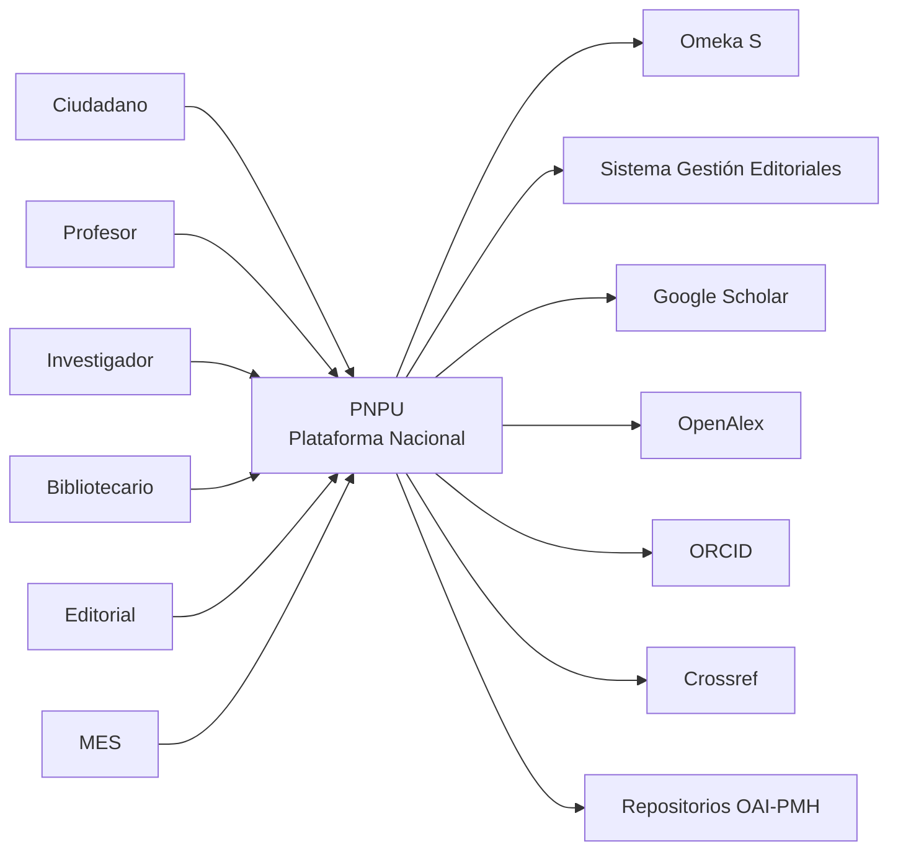

# C4 - Nivel 1
# System Context

## Objetivo

Describir el contexto general de la Plataforma Nacional de Publicaciones Universitarias (PNPU), identificando:

- actores
- sistemas externos
- límites del sistema
- relaciones

Este documento corresponde al **Nivel 1 del modelo C4**.

---

# Visión General

La PNPU actúa como plataforma nacional para descubrir y difundir la producción editorial universitaria cubana.

No sustituye los sistemas existentes.

Los integra.

---

# Diagrama de Contexto

---

# Actores

## Ciudadano

Consulta publicaciones.

No requiere autenticación.

---

## Estudiante

Busca bibliografía.

Consulta autores.

Descarga recursos.

---

## Profesor

Busca publicaciones.

Consulta colecciones.

Comparte referencias.

---

## Investigador

Consulta publicaciones.

Busca por materias.

Exporta citas.

---

## Bibliotecario

Consulta metadatos.

Integra recursos.

---

## Editorial

Administra publicaciones mediante Omeka.

Actualiza información institucional mediante el Sistema de Gestión Editorial.

---

## Administrador MES

Consulta indicadores.

Monitorea la Red.

---

# Sistemas externos

## Omeka S

Responsabilidad

Catálogo bibliográfico nacional.

---

## Sistema Gestión Editoriales

Responsabilidad

Información institucional oficial.

---

## Google Scholar

Motor de descubrimiento.

---

## OpenAlex

Índices científicos.

---

## ORCID

Identificación persistente de investigadores.

---

## Crossref

DOIs.

---

## Repositorios OAI

Interoperabilidad.

---

# Responsabilidades PNPU

La plataforma será responsable de:

- Experiencia pública.
- Descubrimiento.
- Navegación.
- SEO.
- Analítica.
- Integración.
- APIs públicas.
- Observatorio Editorial.

No será responsable de:

- Catalogación bibliográfica.
- Gestión institucional de editoriales.
- Producción editorial.
- Asignación de ISBN.

---

# Límites del sistema

Dentro de PNPU

- Portal Público
- Backend for Frontend
- Buscador
- Dashboard
- CMS
- API Pública

Fuera de PNPU

- Omeka
- Sistema Gestión Editoriales
- Google Scholar
- OpenAlex
- ORCID
- Crossref
- Repositorios

---

# Flujos principales

## Descubrimiento

Usuario

↓

PNPU

↓

Buscador

↓

Omeka

↓

Resultado

---

## Información institucional

Usuario

↓

PNPU

↓

Sistema Gestión Editoriales

↓

Resultado

---

## Indicadores

Administrador

↓

Dashboard

↓

Servicios Analíticos

↓

Indicadores

---

# Interfaces

## Entrada

HTTP

HTTPS

REST

OpenAPI

---

## Salida

REST

JSON

OAI-PMH

Schema.org

JSON-LD

RSS

Sitemap

---

# Objetivos arquitectónicos

- Baja dependencia entre sistemas.
- Integración mediante APIs.
- Fuente única de verdad.
- Alta disponibilidad.
- Escalabilidad.
- Bajo acoplamiento.

---

# Riesgos

- Dependencia de APIs externas.
- Diferencias entre modelos de datos.
- Latencia.
- Calidad de metadatos.

---

# ADR relacionadas

ADR-0001

ADR-0002

ADR-0006

ADR-0007
