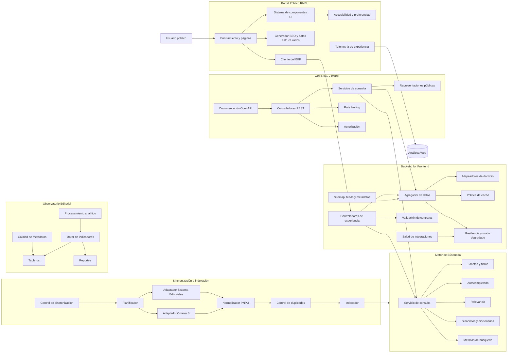

---
title: C4 - Component Diagram
version: 1.0
status: Draft
owner: Ministerio de Educación Superior
project: Plataforma Nacional de Publicaciones Universitarias de Cuba
authors:
  - Equipo de Arquitectura
last_update: 2026-07-14
related_documents:
  - 04-Application-Architecture/01-Application-Landscape.md
  - 04-Application-Architecture/02-C4-Context.md
  - 04-Application-Architecture/03-C4-Containers.md
---

# C4 - Nivel 3
# Component Diagram

## 1. Objetivo

Describir los componentes internos principales de los contenedores críticos de la Plataforma Nacional de Publicaciones Universitarias de Cuba (PNPU).

Este documento profundiza en:

- Portal Público RNEU.
- Backend for Frontend.
- Motor de Búsqueda.
- Observatorio Editorial.
- API Pública PNPU.
- Procesos de sincronización e indexación.

No describe clases, funciones o detalles de implementación de bajo nivel.

---

# 2. Alcance

La primera versión de este documento cubre los componentes necesarios para soportar:

- presentación pública;
- navegación;
- búsqueda;
- integración con fuentes maestras;
- SEO;
- contenidos editoriales;
- analítica;
- sincronización;
- exposición de APIs;
- operación en modo degradado.

---

# 3. Vista general de componentes



---

# 4. Componentes del Portal Público RNEU

## 4.1 Enrutamiento y páginas

### Responsabilidad

Resolver rutas públicas y componer cada tipo de página.

### Páginas mínimas

- Inicio.
- Listado de libros.
- Ficha de libro.
- Listado de editoriales.
- Ficha de editorial.
- Listado de autores.
- Ficha de autor.
- Colecciones.
- Resultados de búsqueda.
- Noticias.
- Página institucional de la Red.
- Contacto.
- Estado de servicios.

### Reglas

- Cada entidad pública debe poseer una URL canónica.
- Las páginas de catálogo deben ser renderizables en servidor.
- Los filtros no deben impedir el rastreo de las páginas principales.
- Las rutas deben usar slugs estables y legibles.

---

## 4.2 Sistema de componentes UI

### Responsabilidad

Proporcionar componentes visuales reutilizables, coherentes y accesibles.

### Componentes mínimos

- Encabezado.
- Navegación principal.
- Buscador global.
- Tarjeta de libro.
- Tarjeta de editorial.
- Tarjeta de autor.
- Filtros.
- Paginación.
- Breadcrumb.
- Alertas.
- Estadísticas.
- Formularios.
- Estados vacíos.
- Estados de error.
- Skeletons de carga.

### Reglas

- Cumplimiento WCAG 2.2 AA.
- Soporte completo de teclado.
- Diseño responsive.
- Componentes sin dependencia directa de las APIs.

---

## 4.3 Generador SEO y datos estructurados

### Responsabilidad

Generar metadatos y representaciones estructuradas para cada recurso.

### Funciones

- `title`.
- `meta description`.
- URL canónica.
- Open Graph.
- tarjetas sociales.
- JSON-LD.
- breadcrumbs estructurados.
- alternates por idioma.
- directivas de indexación.

### Tipos Schema.org

- `Book`.
- `Person`.
- `Organization`.
- `CollectionPage`.
- `BreadcrumbList`.
- `WebSite`.
- `SearchAction`.
- `Article`.
- `Event`.

---

## 4.4 Cliente del Backend for Frontend

### Responsabilidad

Centralizar la comunicación del frontend con el BFF.

### Funciones

- Cliente HTTP tipado.
- Gestión de errores.
- Timeouts.
- Reintentos solo en operaciones idempotentes.
- Trazabilidad mediante identificador de correlación.
- Soporte de caché del framework.
- Cancelación de solicitudes.

### Restricción

El Portal no podrá acceder directamente a Omeka S, al Sistema de Gestión de Editoriales ni a sus bases de datos.

---

## 4.5 Accesibilidad y preferencias

### Responsabilidad

Gestionar preferencias de experiencia y requisitos de accesibilidad.

### Funciones

- Preferencia de contraste.
- Tamaño de texto, cuando proceda.
- Reducción de movimiento.
- Gestión del foco.
- Anuncios para lectores de pantalla.
- Persistencia local de preferencias no sensibles.

---

## 4.6 Telemetría de experiencia

### Responsabilidad

Registrar métricas de uso sin afectar la privacidad.

### Eventos mínimos

- búsqueda ejecutada;
- resultado seleccionado;
- descarga;
- salida hacia repositorio;
- visita a editorial;
- uso de filtros;
- búsqueda sin resultados;
- error visible;
- métricas Web Vitals.

---

# 5. Componentes del Backend for Frontend

## 5.1 Controladores de experiencia

### Responsabilidad

Exponer endpoints optimizados para los casos de uso del Portal.

### Endpoints internos previstos

```text
GET /api/site/home
GET /api/site/search
GET /api/site/books
GET /api/site/books/{slug}
GET /api/site/publishers
GET /api/site/publishers/{slug}
GET /api/site/authors
GET /api/site/authors/{slug}
GET /api/site/collections
GET /api/site/news
GET /api/site/health
```

### Regla

Los endpoints internos no deben reflejar directamente la estructura de las APIs maestras.

---

## 5.2 Agregador de datos

### Responsabilidad

Combinar datos procedentes de múltiples fuentes.

### Ejemplo

Para construir una ficha editorial puede combinar:

- información institucional del Sistema de Gestión de Editoriales;
- libros de Omeka S;
- estadísticas del Observatorio;
- noticias del CMS;
- estado técnico de enlaces.

### Reglas

- Las fuentes maestras conservan prioridad.
- Los datos derivados deben indicar fecha de actualización.
- Las respuestas parciales deben marcarse explícitamente.

---

## 5.3 Mapeadores de dominio

### Responsabilidad

Transformar formatos externos hacia modelos internos PNPU.

### Modelos canónicos

- `PublicationSummary`.
- `PublicationDetail`.
- `PublisherSummary`.
- `PublisherDetail`.
- `ContributorSummary`.
- `ContributorDetail`.
- `CollectionSummary`.
- `SearchResult`.
- `NewsItem`.
- `KpiSummary`.

### Regla

Los componentes del Portal solo consumirán modelos canónicos PNPU.

---

## 5.4 Validación de contratos

### Responsabilidad

Validar entradas y respuestas externas.

### Funciones

- validación de parámetros;
- validación de cuerpos;
- validación de respuestas de terceros;
- normalización de valores nulos;
- control de tipos;
- mensajes de error coherentes.

### Requisito

Toda respuesta externa debe validarse antes de entrar al dominio de la PNPU.

---

## 5.5 Política de caché

### Responsabilidad

Determinar qué puede almacenarse en caché, durante cuánto tiempo y cómo se invalida.

### Categorías

| Recurso | TTL sugerido |
|---|---:|
| Página inicial | 5 minutos |
| Listado de editoriales | 30 minutos |
| Ficha editorial | 30 minutos |
| Ficha bibliográfica | 15 minutos |
| Resultados de búsqueda | 2 minutos |
| Noticias | 5 minutos |
| Indicadores públicos | 15 minutos |
| Sitemap | 60 minutos |

Los valores son iniciales y deberán ajustarse con métricas reales.

---

## 5.6 Resiliencia y modo degradado

### Responsabilidad

Evitar que el fallo de una fuente externa afecte toda la experiencia pública.

### Mecanismos

- timeout por integración;
- reintentos con backoff;
- circuit breaker;
- caché de último valor válido;
- respuesta parcial;
- mensajes de disponibilidad;
- registro de errores;
- alertas operativas.

### Ejemplo

Si Omeka S no está disponible:

- el Portal debe seguir mostrando información institucional;
- puede ofrecer fichas bibliográficas en caché;
- debe desactivar operaciones no disponibles;
- no debe responder con error general del sitio.

---

## 5.7 Generador de sitemap, feeds y metadatos

### Responsabilidad

Producir artefactos de descubrimiento automatizados.

### Artefactos

- `sitemap.xml`.
- sitemap segmentado por tipo.
- `robots.txt`.
- RSS/Atom de novedades.
- feeds de nuevos libros.
- listas de URLs modificadas.
- manifestaciones de datos estructurados.

---

## 5.8 Salud de integraciones

### Responsabilidad

Comprobar y publicar el estado de dependencias.

### Comprobaciones

- API de Editoriales.
- Omeka S.
- CMS.
- Redis.
- PostgreSQL.
- Motor de búsqueda.
- Servicio de almacenamiento.
- Analítica.

### Estados

- disponible;
- degradado;
- no disponible;
- desconocido.

---

# 6. Componentes de sincronización e indexación

## 6.1 Planificador

### Responsabilidad

Ejecutar sincronizaciones periódicas.

### Tipos de trabajo

- sincronización incremental de editoriales;
- sincronización incremental de publicaciones;
- reconstrucción del índice;
- verificación de enlaces;
- actualización de indicadores;
- regeneración de sitemap.

---

## 6.2 Adaptador del Sistema de Gestión de Editoriales

### Responsabilidad

Consumir y traducir la API institucional.

### Funciones

- autenticación técnica;
- paginación;
- filtros por fecha de modificación;
- gestión de errores;
- control de versiones;
- trazabilidad.

---

## 6.3 Adaptador Omeka S

### Responsabilidad

Consumir recursos y relaciones desde Omeka S.

### Funciones

- consulta de items;
- consulta de item sets;
- consulta de media;
- consulta de vocabularios;
- resolución de relaciones;
- paginación;
- transformación del JSON-LD de Omeka.

---

## 6.4 Normalizador PNPU

### Responsabilidad

Transformar datos externos al modelo canónico.

### Funciones

- normalización de nombres;
- fechas ISO 8601;
- idiomas ISO 639;
- identificadores;
- URLs;
- licencias;
- materias;
- formatos MIME;
- estados de publicación.

---

## 6.5 Control de duplicados

### Responsabilidad

Detectar recursos potencialmente duplicados.

### Criterios para publicaciones

- ISBN.
- eISBN.
- DOI.
- título normalizado + editorial + año.
- identificador de origen.

### Criterios para personas

- ORCID.
- nombre normalizado + afiliación.
- identificador de origen.

### Resultado

- coincidencia segura;
- posible duplicado;
- recurso nuevo;
- conflicto manual.

---

## 6.6 Indexador

### Responsabilidad

Crear o actualizar documentos en el motor de búsqueda.

### Documento de publicación

Debe incluir:

- identificador;
- título;
- subtítulo;
- resumen;
- autores;
- editorial;
- universidad;
- colección;
- materias;
- palabras clave;
- ISBN;
- año;
- idioma;
- tipo de acceso;
- licencia;
- URL pública;
- fecha de actualización.

---

## 6.7 Control de sincronización

### Responsabilidad

Mantener checkpoints y trazabilidad.

### Datos

- fecha de última ejecución;
- cursor de origen;
- versión de esquema;
- cantidad procesada;
- cantidad fallida;
- duración;
- estado;
- identificador de correlación.

---

# 7. Componentes del Motor de Búsqueda

## 7.1 Servicio de consulta

### Responsabilidad

Recibir consultas normalizadas y devolver resultados paginados.

### Capacidades

- búsqueda libre;
- búsqueda exacta;
- búsqueda por ISBN;
- búsqueda por autor;
- búsqueda por editorial;
- búsqueda por colección;
- ordenamiento;
- paginación.

---

## 7.2 Facetas y filtros

### Facetas iniciales

- editorial;
- universidad;
- año;
- área temática;
- idioma;
- tipo documental;
- licencia;
- acceso;
- colección.

---

## 7.3 Autocompletado

### Responsabilidad

Sugerir términos y entidades durante la escritura.

### Fuentes

- títulos;
- autores;
- editoriales;
- colecciones;
- materias.

---

## 7.4 Relevancia

### Señales iniciales

- coincidencia exacta de título;
- ISBN;
- coincidencia de autor;
- términos en título;
- términos en resumen;
- fecha;
- disponibilidad del recurso;
- calidad de metadatos.

### Regla

La relevancia debe ser configurable y medible.

---

## 7.5 Sinónimos y diccionarios

### Contenido inicial

- siglas institucionales;
- variantes de nombres de universidades;
- variantes de editoriales;
- términos académicos equivalentes;
- tildes y variantes ortográficas controladas.

---

## 7.6 Métricas de búsqueda

### Indicadores

- consultas totales;
- consultas sin resultados;
- términos más buscados;
- CTR de resultados;
- tiempo de respuesta;
- filtros utilizados;
- reformulaciones.

---

# 8. Componentes de la API Pública

## 8.1 Controladores REST

### Recursos

- `/v1/publications`.
- `/v1/contributors`.
- `/v1/publishers`.
- `/v1/collections`.
- `/v1/subjects`.
- `/v1/search`.

---

## 8.2 Servicios de consulta

### Responsabilidad

Aplicar reglas de negocio y combinar datos normalizados.

### Restricción

No deben consultar directamente bases de datos maestras.

---

## 8.3 Representaciones públicas

### Formatos iniciales

- JSON.
- JSON-LD.
- CSV para exportaciones permitidas.

### Futuros

- OAI-PMH.
- Dublin Core XML.
- IIIF Presentation API cuando corresponda.

---

## 8.4 Rate limiting

### Responsabilidad

Proteger la plataforma del uso abusivo.

### Criterios

- IP.
- API key.
- consumidor registrado.
- ruta.
- volumen temporal.

---

## 8.5 Autorización

La mayoría de consultas serán públicas.

Se requerirá autorización para:

- exportaciones masivas;
- indicadores restringidos;
- operaciones administrativas;
- acceso a datos no públicos.

---

## 8.6 Documentación OpenAPI

### Requisitos

- OpenAPI 3.1.
- ejemplos reales.
- esquemas reutilizables.
- errores documentados.
- paginación.
- filtros.
- versionado.
- política de deprecación.

---

# 9. Componentes del Observatorio Editorial

## 9.1 Procesamiento analítico

### Responsabilidad

Preparar datos para indicadores y reportes.

### Procesos

- agregación diaria;
- consolidación mensual;
- cálculo de tendencias;
- control de calidad;
- desidentificación cuando proceda.

---

## 9.2 Motor de indicadores

### Indicadores iniciales

- editoriales activas;
- publicaciones por editorial;
- publicaciones por universidad;
- producción anual;
- publicaciones por área;
- porcentaje de acceso abierto;
- libros con ISBN;
- libros con archivo digital;
- autores con ORCID;
- calidad de metadatos;
- visitas y descargas.

---

## 9.3 Tableros

### Audiencias

- Dirección del MES.
- Coordinación RNEU.
- Directores editoriales.
- Público general, para indicadores seleccionados.

---

## 9.4 Reportes

### Salidas

- PDF.
- CSV.
- hojas de cálculo.
- vistas imprimibles.
- informes programados.

---

## 9.5 Calidad de metadatos

### Reglas iniciales

- campos obligatorios presentes;
- ISBN válido;
- URL accesible;
- portada disponible;
- licencia informada;
- autor normalizado;
- editorial reconocida;
- materia controlada.

### Resultado

Cada publicación podrá recibir una puntuación de calidad de metadatos.

---

# 10. Contratos entre componentes

## 10.1 Portal → BFF

- REST interno.
- JSON.
- contratos tipados.
- solo lectura para el portal público.
- identificador de correlación.

## 10.2 BFF → fuentes maestras

- HTTPS.
- autenticación técnica.
- validación de respuestas.
- timeout.
- reintentos controlados.
- métricas por integración.

## 10.3 Sincronización → motor de búsqueda

- escritura idempotente.
- actualización por identificador estable.
- soporte de reconstrucción total.
- registro de errores por documento.

## 10.4 Observatorio → almacén analítico

- consultas de solo lectura para tableros.
- procesos de escritura separados.
- vistas o tablas agregadas.
- control de acceso por rol.

---

# 11. Reglas de diseño de componentes

## CP-001

Cada componente debe tener una responsabilidad principal.

## CP-002

Los componentes de presentación no accederán a fuentes maestras.

## CP-003

Los adaptadores externos estarán aislados del modelo canónico.

## CP-004

Toda integración deberá validar contratos.

## CP-005

Las operaciones de sincronización deberán ser idempotentes.

## CP-006

Los índices y agregados deberán poder reconstruirse.

## CP-007

Los componentes críticos deberán emitir métricas y logs estructurados.

## CP-008

La lógica de SEO no deberá duplicarse entre páginas.

## CP-009

Los componentes de dominio no dependerán de componentes visuales.

## CP-010

Los errores externos se transformarán en errores internos normalizados.

---

# 12. Paquetes lógicos sugeridos

```text
src/
├── app/
│   ├── books/
│   ├── publishers/
│   ├── authors/
│   ├── collections/
│   ├── news/
│   └── api/
├── components/
│   ├── ui/
│   ├── books/
│   ├── publishers/
│   ├── search/
│   └── layout/
├── domain/
│   ├── publication/
│   ├── publisher/
│   ├── contributor/
│   ├── collection/
│   └── search/
├── application/
│   ├── queries/
│   ├── services/
│   ├── mappers/
│   └── validators/
├── infrastructure/
│   ├── omeka/
│   ├── editorial-registry/
│   ├── cms/
│   ├── search/
│   ├── cache/
│   └── analytics/
└── shared/
    ├── errors/
    ├── logging/
    ├── observability/
    ├── config/
    └── types/
```

Esta estructura es orientativa y deberá ajustarse al repositorio real.

---

# 13. Riesgos

| Riesgo | Mitigación |
|---|---|
| BFF excesivamente complejo | Separar agregación, mapeo y adaptadores |
| Duplicación de lógica entre BFF y API pública | Reutilizar servicios de aplicación |
| Acoplamiento a Omeka S | Adaptador y modelo canónico |
| Índices inconsistentes | Checkpoints, idempotencia y reconstrucción |
| SEO incompleto | Componente centralizado y pruebas automatizadas |
| Errores silenciosos de sincronización | Métricas, alertas y panel de fallos |
| Componentes UI inaccesibles | Biblioteca accesible y pruebas |
| Crecimiento del Observatorio | Separar procesamiento, KPIs y presentación |

---

# 14. Decisiones arquitectónicas relacionadas

- ADR-0015: Uso de adaptadores para sistemas externos.
- ADR-0016: Modelo canónico PNPU entre integraciones y presentación.
- ADR-0017: Sincronizaciones idempotentes y reconstruibles.
- ADR-0018: SEO gestionado mediante un componente transversal.
- ADR-0019: Observatorio separado de las fuentes maestras.
- ADR-0020: Componentes organizados por dominio y no solo por capa técnica.

---

# 15. Criterios de aceptación

El diseño de componentes se considerará aprobado cuando:

- los contenedores críticos estén descompuestos en componentes coherentes;
- cada componente tenga responsabilidades explícitas;
- los contratos entre componentes estén identificados;
- las dependencias externas estén encapsuladas;
- el modelo canónico esté definido;
- la estrategia de sincronización e indexación sea clara;
- los componentes de SEO, búsqueda y analítica estén separados;
- las reglas de diseño hayan sido validadas por el equipo de desarrollo.
