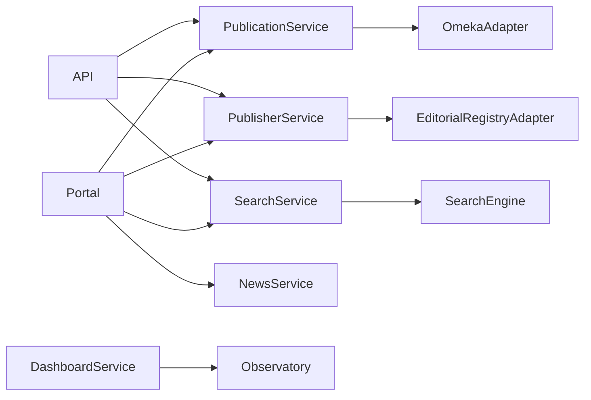

---
title: Application Services
version: 1.0
status: Draft
owner: Ministerio de Educación Superior
project: Plataforma Nacional de Publicaciones Universitarias de Cuba
---

# Application Services

## Objetivo

Definir los servicios de aplicación que implementan los casos de uso de la PNPU.
Los servicios orquestan el dominio y las integraciones; no contienen lógica de presentación.

---

# Principios

- Un servicio implementa un caso de uso.
- No accede directamente a interfaces de usuario.
- Consume repositorios o adaptadores.
- Es reutilizable por Portal, API Pública y procesos programados.
- Toda operación es trazable.

---

# Catálogo de servicios

| Servicio | Responsabilidad | Release |
|----------|-----------------|---------|
| PublicationService | Consultar publicaciones | R1 |
| PublisherService | Consultar editoriales | R1 |
| ContributorService | Consultar autores | R2 |
| CollectionService | Gestionar colecciones | R2 |
| SearchService | Orquestar búsquedas | R2 |
| NewsService | Noticias y contenidos | R1 |
| DashboardService | KPIs públicos | R3 |
| MetadataQualityService | Calidad de metadatos | R3 |
| SynchronizationService | Sincronización | R2 |
| IndexService | Indexación | R2 |
| SitemapService | Sitemap y feeds | R1 |
| NotificationService | Notificaciones | R3 |

---

# PublicationService

## Casos de uso

- Obtener ficha pública.
- Listar publicaciones.
- Publicaciones recientes.
- Publicaciones relacionadas.
- Exportar cita.
- Obtener recursos disponibles.

## Entradas

- id
- slug
- ISBN
- filtros
- paginación

## Salidas

- PublicationSummary
- PublicationDetail

## Dependencias

- OmekaAdapter
- SearchService
- Cache

---

# PublisherService

## Casos de uso

- Listar editoriales.
- Consultar ficha editorial.
- Obtener publicaciones de una editorial.
- Obtener estadísticas públicas.

## Fuente maestra

Sistema de Gestión de Editoriales.

---

# ContributorService

Gestiona consultas de autores y colaboradores.

Funciones:

- ficha pública;
- publicaciones;
- ORCID;
- afiliaciones.

---

# CollectionService

Funciones:

- listar colecciones;
- navegar series;
- publicaciones por colección;
- destacados.

---

# SearchService

Responsabilidad:

Orquestar todas las búsquedas.

Funciones:

- búsqueda libre;
- búsqueda avanzada;
- autocompletar;
- filtros;
- sugerencias;
- historial agregado.

Dependencias:

- Search Engine
- Cache

---

# NewsService

Gestiona:

- noticias;
- eventos;
- convocatorias;
- páginas.

Fuente:

CMS.

---

# DashboardService

Expone:

- publicaciones por editorial;
- publicaciones por universidad;
- tendencias;
- indicadores.

Fuente:

Observatorio Editorial.

---

# MetadataQualityService

Calcula:

- completitud;
- identificadores;
- licencias;
- portadas;
- materias;
- ORCID;
- consistencia.

Resultado:

Puntuación 0-100.

---

# SynchronizationService

Responsabilidad

Coordinar sincronizaciones.

Procesos:

- Editoriales.
- Publicaciones.
- Colecciones.
- Recursos.
- Indicadores.

Requisitos:

- idempotencia;
- reanudación;
- auditoría.

---

# IndexService

Responsabilidad

Actualizar índices de búsqueda.

Operaciones

- indexar;
- actualizar;
- eliminar;
- reconstrucción completa.

---

# SitemapService

Genera automáticamente:

- sitemap.xml
- sitemap-publications.xml
- sitemap-publishers.xml
- sitemap-authors.xml
- RSS novedades
- robots.txt

---

# NotificationService

Canales:

- correo;
- alertas administrativas;
- boletines.

---

# Modelo de interacción

---

# Convenciones

## Nomenclatura

- *Service para casos de uso.
- *Adapter para sistemas externos.
- *Repository para persistencia.
- *Mapper para transformación.
- *Validator para reglas.

---

# Errores normalizados

| Código | Descripción |
|---------|-------------|
| PNPU-404 | Recurso inexistente |
| PNPU-409 | Conflicto |
| PNPU-422 | Validación |
| PNPU-429 | Límite excedido |
| PNPU-503 | Servicio externo no disponible |

---

# Observabilidad

Cada servicio deberá registrar:

- tiempo de ejecución;
- identificador de correlación;
- dependencia utilizada;
- resultado;
- métricas de éxito y fallo.

---

# Criterios de aceptación

- Cada caso de uso pertenece a un único servicio.
- Ningún servicio conoce detalles de UI.
- Los adaptadores encapsulan sistemas externos.
- Todos los servicios son reutilizables desde Portal y API Pública.
