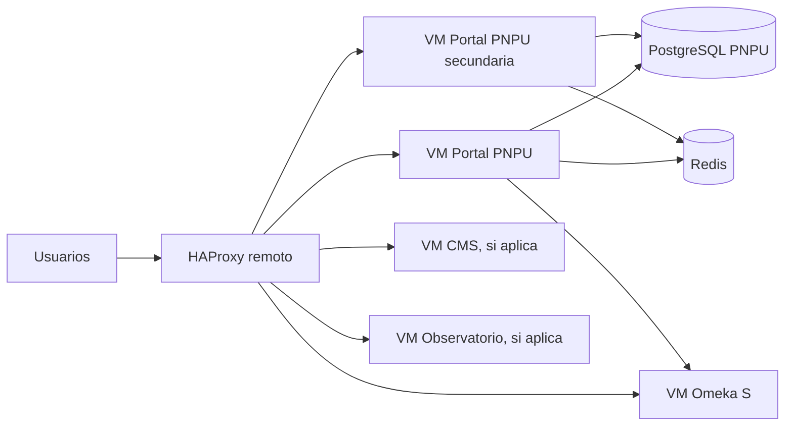
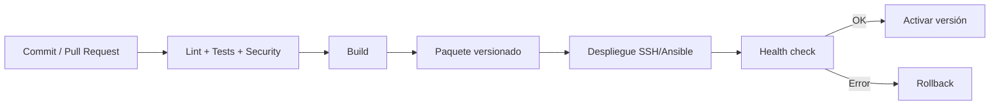

# Technology Stack

## 1. Objetivo

Definir el stack tecnológico oficial de la PNPU considerando el entorno real del MES.

La plataforma se desplegará directamente sobre máquinas virtuales con Ubuntu Server. No se utilizarán Docker, Docker Compose ni Kubernetes. Todas las aplicaciones estarán detrás de un HAProxy remoto.

## 2. Principios tecnológicos

- Software libre por defecto.
- Despliegue sobre Ubuntu Server LTS.
- Sin contenedores.
- HAProxy remoto como único punto de entrada.
- Automatización reproducible mediante Ansible y scripts idempotentes.
- Servicios gestionados por systemd.
- Separación por responsabilidad.
- Mínima diversidad tecnológica.

## 3. Stack general

| Capa | Tecnología |
|---|---|
| Sistema operativo | Ubuntu Server LTS |
| Proxy y balanceo externo | HAProxy remoto |
| Proxy interno opcional | Nginx |
| Frontend | Next.js |
| UI | React |
| Lenguaje | TypeScript |
| Estilos | Tailwind CSS |
| Backend for Frontend | Next.js Route Handlers / Node.js |
| API | REST + OpenAPI 3.1 |
| Catálogo bibliográfico | Omeka S |
| CMS | Markdown/MDX en R1; Directus si se necesita CMS visual |
| Base de datos PNPU | PostgreSQL |
| Base de datos Omeka S | MariaDB/MySQL |
| Caché | Redis o Valkey |
| Búsqueda inicial | PostgreSQL Full Text Search |
| Búsqueda avanzada | OpenSearch cuando el volumen lo justifique |
| Identidad | Keycloak o proveedor institucional |
| Almacenamiento | NAS, filesystem institucional o MinIO si se aprueba |
| Analítica web | Matomo |
| Observabilidad | Prometheus, Grafana y Loki |
| Automatización | Ansible + Bash |
| Gestión de procesos | systemd |
| CI/CD | GitHub Actions + despliegue remoto controlado |
| Documentación | Markdown + MkDocs Material |

## 4. Modelo de publicación



## 5. HAProxy remoto

Responsabilidades:

- terminación TLS;
- publicación de dominios;
- balanceo entre instancias;
- health checks;
- redirección HTTP a HTTPS;
- ocultamiento de la topología interna;
- registro de accesos.

Reglas:

- Las aplicaciones escucharán solo en redes privadas.
- Las aplicaciones no administrarán certificados públicos.
- Los encabezados `X-Forwarded-*` deberán configurarse y validarse.
- Cada aplicación expondrá `/health/live` y `/health/ready`.

## 6. Nginx interno

Nginx será opcional y se utilizará para:

- servir archivos estáticos;
- actuar como reverse proxy local;
- aplicar compresión;
- administrar límites de tamaño;
- aislar procesos Node.js o PHP.

No gestionará TLS público ni balanceo externo.

## 7. Frontend y BFF

Tecnologías:

- Next.js;
- React;
- TypeScript;
- Tailwind CSS;
- Node.js LTS.

La aplicación se ejecutará mediante Node.js y systemd.

Ejemplo conceptual:

```ini
[Unit]
Description=PNPU Portal
After=network.target

[Service]
Type=simple
User=pnpu
WorkingDirectory=/opt/pnpu/portal/current
EnvironmentFile=/etc/pnpu/portal.env
ExecStart=/usr/bin/npm run start
Restart=always
RestartSec=5

[Install]
WantedBy=multi-user.target
```

## 8. Omeka S

Omeka S se instalará directamente sobre Ubuntu Server.

Componentes:

- Nginx o Apache según decisión operativa;
- PHP compatible;
- MariaDB/MySQL;
- ImageMagick;
- módulos PHP requeridos;
- almacenamiento persistente;
- tareas programadas;
- copias de seguridad.

El acceso público será siempre mediante HAProxy.

## 9. CMS

R1: Markdown/MDX versionado en Git.

Si se requiere edición visual descentralizada, se evaluará Directus instalado directamente sobre Ubuntu y gestionado por systemd.

## 10. PostgreSQL

Responsabilidades:

- configuración PNPU;
- sincronizaciones;
- datos derivados;
- auditoría;
- analítica;
- búsqueda inicial;
- vistas materializadas.

Preferentemente en una VM dedicada y nunca expuesta públicamente.

## 11. Redis o Valkey

Usos:

- caché;
- rate limiting;
- locks;
- sesiones técnicas;
- datos efímeros.

Nunca será fuente de verdad.

## 12. Búsqueda

R1/R2: PostgreSQL Full Text Search.

Evolución a OpenSearch cuando existan necesidades de facetas complejas, alta concurrencia, relevancia avanzada o búsqueda semántica.

## 13. Identidad

Tecnología candidata: Keycloak, salvo que el MES disponga de un proveedor compatible.

Capacidades:

- OIDC;
- OAuth 2.0;
- SSO;
- MFA;
- LDAP/AD;
- roles;
- grupos.

## 14. Almacenamiento

Opciones:

1. filesystem local con redundancia;
2. NAS institucional;
3. MinIO sobre VM;
4. repositorios institucionales;
5. modelo híbrido.

Recomendación: modelo híbrido.

## 15. Observabilidad

Stack:

- Prometheus;
- Grafana;
- Loki;
- exporters de sistema;
- exporters PostgreSQL;
- métricas Node.js;
- métricas HAProxy;
- OpenTelemetry en una fase posterior.

## 16. Analítica

Matomo como solución institucional de analítica web.

## 17. Automatización

Al no utilizar contenedores, la automatización es obligatoria.

Tecnología recomendada: Ansible.

Debe cubrir:

- usuarios de servicio;
- paquetes;
- firewall;
- despliegues;
- systemd;
- Nginx;
- variables;
- actualizaciones;
- rollback;
- backups;
- monitorización.

## 18. CI/CD



## 19. Estructura de despliegue

```text
/opt/pnpu/<aplicacion>/
├── releases/
│   ├── 1.0.0/
│   ├── 1.0.1/
│   └── 1.1.0/
├── current -> releases/1.1.0
└── shared/
    ├── uploads/
    ├── logs/
    └── config/
```

## 20. Alta disponibilidad

Portal:

- dos VMs cuando sea necesario;
- ambas detrás de HAProxy;
- sesiones sin estado;
- caché compartida;
- archivos fuera del filesystem local.

Bases de datos:

- respaldos;
- réplica si el SLA lo exige;
- procedimiento de conmutación documentado.

## 21. Tecnologías excluidas

| Tecnología | Estado | Motivo |
|---|---|---|
| Docker | Excluida | Decisión de infraestructura |
| Docker Compose | Excluida | No se utilizarán contenedores |
| Kubernetes | Excluida | Complejidad innecesaria |
| Podman | Excluida | Mismo modelo de contenedores |
| Exposición directa de aplicaciones | Prohibida | HAProxy remoto obligatorio |
| Certificados públicos locales | No requeridos | TLS termina en HAProxy |
| Acceso público a bases de datos | Prohibido | Seguridad |

## 22. Riesgos del despliegue sin contenedores

| Riesgo | Mitigación |
|---|---|
| Diferencias entre servidores | Ansible y una sola versión de Ubuntu |
| Dependencias inconsistentes | Versiones fijadas |
| Despliegues manuales | CI/CD automatizado |
| Rollback complejo | Estructura `releases/current` |
| Colisiones de puertos | Inventario técnico |
| Configuración dispersa | `/etc/pnpu` + Ansible Vault |
| Reproducción difícil | Playbooks idempotentes |

## 23. Roadmap tecnológico

### Release 1

- Ubuntu Server LTS;
- HAProxy remoto;
- Portal Next.js;
- Node.js;
- PostgreSQL;
- Redis/Valkey;
- Markdown/MDX;
- integración con Sistema de Gestión de Editoriales;
- Ansible;
- systemd;
- Matomo.

### Release 2

- Omeka S;
- Keycloak o identidad institucional;
- búsqueda integrada;
- almacenamiento institucional;
- Directus solo si se justifica.

### Release 3

- Observatorio;
- OpenSearch si se cumplen criterios;
- Prometheus, Grafana y Loki completos;
- notificaciones;
- eventos iniciales.

### Release 4

- API pública;
- OAI-PMH;
- IIIF;
- búsqueda semántica;
- recomendaciones;
- integraciones académicas avanzadas.

## 24. ADR relacionadas

- ADR-0024: HAProxy remoto como punto único de entrada.
- ADR-0025: Despliegue directo sobre Ubuntu Server.
- ADR-0026: No utilización de contenedores.
- ADR-0027: Ansible para automatización.
- ADR-0028: systemd para gestión de procesos.
- ADR-0029: TLS terminado en HAProxy remoto.

## 25. Criterios de aceptación

- Docker eliminado de toda la documentación.
- Aplicaciones diseñadas para Ubuntu Server.
- HAProxy como único punto público de entrada.
- Sin certificados públicos en las aplicaciones.
- Cada proceso gestionado por systemd.
- Instalación reproducible con Ansible.
- Rollback documentado.
- Bases de datos en red privada.
- Monitorización de VMs, aplicaciones y dependencias.
