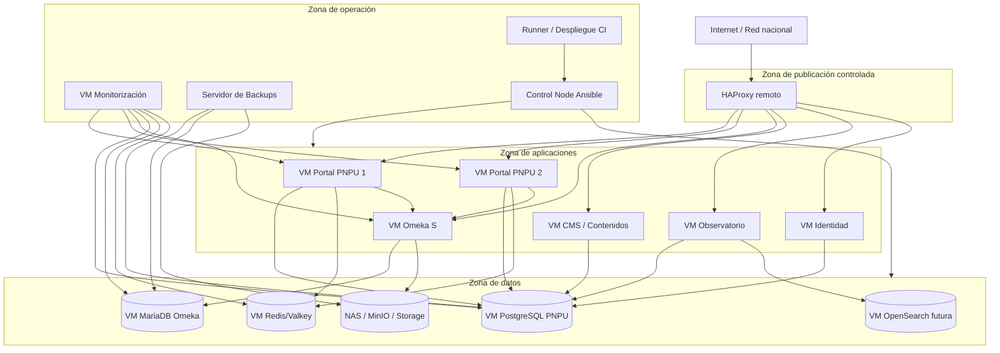
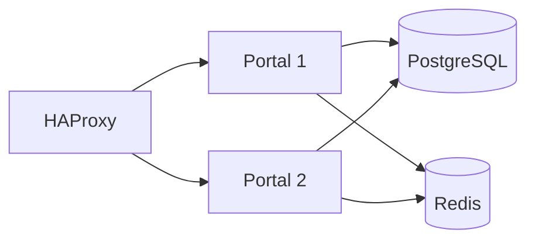

# Infrastructure Architecture

## 1. Objetivo

Definir la arquitectura de infraestructura de la Plataforma Nacional de Publicaciones Universitarias de Cuba (PNPU) para su despliegue sobre máquinas virtuales Ubuntu Server, sin uso de contenedores, y con todas las aplicaciones publicadas detrás de un HAProxy remoto.

Este documento establece:

- topología lógica;
- distribución de máquinas virtuales;
- redes y zonas;
- flujos de comunicación;
- requisitos de capacidad;
- alta disponibilidad;
- almacenamiento;
- seguridad de infraestructura;
- operación y crecimiento.

---

# 2. Supuestos y restricciones

## 2.1 Supuestos

- El MES dispone de infraestructura de virtualización.
- El HAProxy remoto es administrado por el equipo de infraestructura.
- El HAProxy realiza terminación TLS y balanceo.
- Las máquinas virtuales se ejecutan con Ubuntu Server LTS.
- Las bases de datos no estarán expuestas públicamente.
- Las aplicaciones se gestionarán mediante systemd.
- La automatización se realizará con Ansible.
- Los respaldos se almacenarán fuera de las VMs de producción.

## 2.2 Restricciones

- No se utilizarán Docker, Docker Compose, Podman ni Kubernetes.
- No se instalarán certificados públicos en las VMs de aplicación.
- Ninguna aplicación podrá exponerse directamente a Internet.
- No se permitirá acceso directo desde el frontend a bases de datos o sistemas maestros.
- Toda comunicación entre componentes deberá estar documentada y autorizada.
- Las versiones de Ubuntu Server deberán mantenerse homogéneas.

---

# 3. Arquitectura lógica



---

# 4. Zonas de infraestructura

## 4.1 Zona de publicación

Contiene el HAProxy remoto.

Responsabilidades:

- terminación TLS;
- publicación de dominios;
- balanceo;
- health checks;
- redirecciones;
- control de acceso inicial;
- registro de conexiones.

## 4.2 Zona de aplicaciones

Contiene las VMs que ejecutan:

- Portal PNPU;
- Omeka S;
- CMS;
- Observatorio;
- Identidad;
- servicios auxiliares.

Estas VMs solo aceptarán tráfico desde:

- HAProxy;
- nodos de administración autorizados;
- componentes internos explícitamente permitidos.

## 4.3 Zona de datos

Contiene:

- PostgreSQL;
- MariaDB/MySQL;
- Redis/Valkey;
- motor de búsqueda;
- almacenamiento de archivos.

No tendrá exposición pública.

## 4.4 Zona de operación

Contiene:

- monitorización;
- backups;
- Ansible;
- runners o nodos de despliegue;
- herramientas de auditoría.

---

# 5. Inventario inicial de máquinas virtuales

## 5.1 Release 1

| VM | Función | vCPU inicial | RAM inicial | Disco inicial |
|---|---|---:|---:|---:|
| pnpu-web-01 | Portal + BFF | 4 | 8 GB | 80 GB |
| pnpu-db-01 | PostgreSQL PNPU | 4 | 16 GB | 200 GB |
| pnpu-cache-01 | Redis/Valkey | 2 | 4 GB | 40 GB |
| pnpu-monitor-01 | Prometheus/Grafana/Loki inicial | 4 | 8 GB | 200 GB |
| pnpu-ansible-01 | Automatización y despliegue | 2 | 4 GB | 40 GB |

## 5.2 Release 2

| VM | Función | vCPU inicial | RAM inicial | Disco inicial |
|---|---|---:|---:|---:|
| pnpu-omeka-01 | Omeka S + PHP + Nginx/Apache | 4 | 8 GB | 100 GB |
| pnpu-omeka-db-01 | MariaDB/MySQL Omeka | 4 | 16 GB | 300 GB |
| pnpu-storage-01 | MinIO o gateway hacia almacenamiento | 4 | 8 GB | Según política |
| pnpu-idp-01 | Keycloak o identidad | 4 | 8 GB | 100 GB |

## 5.3 Release 3

| VM | Función | vCPU inicial | RAM inicial | Disco inicial |
|---|---|---:|---:|---:|
| pnpu-web-02 | Segunda instancia del Portal | 4 | 8 GB | 80 GB |
| pnpu-observatory-01 | Observatorio Editorial | 4 | 8 GB | 100 GB |
| pnpu-search-01 | OpenSearch inicial | 8 | 32 GB | 500 GB |
| pnpu-notify-01 | Notificaciones y tareas | 2 | 4 GB | 60 GB |

Los valores son iniciales y deberán ajustarse mediante pruebas de carga.

---

# 6. Nombres y dominios

## 6.1 Convención de hostname

```text
pnpu-<funcion>-<numero>
```

Ejemplos:

```text
pnpu-web-01
pnpu-db-01
pnpu-omeka-01
pnpu-search-01
```

## 6.2 Dominios sugeridos

```text
www.rneu.mes.gob.cu
catalogo.rneu.mes.gob.cu
omeka.rneu.mes.gob.cu
observatorio.rneu.mes.gob.cu
api.rneu.mes.gob.cu
identidad.rneu.mes.gob.cu
estado.rneu.mes.gob.cu
```

Los nombres definitivos deberán validarse con el equipo de infraestructura y comunicaciones.

---

# 7. Puertos y comunicaciones

| Origen | Destino | Puerto | Protocolo | Uso |
|---|---|---:|---|---|
| HAProxy | Portal | 3000 o proxy local | TCP/HTTP | Publicación |
| HAProxy | Omeka | 80 interno | TCP/HTTP | Publicación |
| HAProxy | CMS | Puerto aplicación | TCP/HTTP | Publicación |
| Portal | PostgreSQL | 5432 | TCP | Datos PNPU |
| Portal | Redis | 6379 | TCP | Caché |
| Portal | Omeka | 80/443 interno | HTTP(S) | API |
| Omeka | MariaDB | 3306 | TCP | Catálogo |
| Omeka | Storage | 9000/NFS/SMB | Según solución | Medios |
| Observatorio | PostgreSQL | 5432 | TCP | Indicadores |
| Monitorización | Exporters | 9100 y específicos | TCP | Métricas |
| Ansible | VMs | 22 | SSH | Automatización |
| CI Runner | Ansible | 22/HTTPS | SSH/HTTPS | Despliegue |

Toda apertura deberá aplicarse mediante listas de control explícitas.

---

# 8. HAProxy remoto

## 8.1 Funciones obligatorias

- TLS 1.2 o superior;
- redirección HTTP a HTTPS;
- balanceo round-robin o least connections;
- health checks;
- cabeceras `X-Forwarded-For`, `X-Forwarded-Proto` y `X-Forwarded-Host`;
- logs de acceso;
- límites de conexión;
- timeouts;
- publicación por hostname.

## 8.2 Health checks

Cada aplicación deberá exponer:

```text
/health/live
/health/ready
```

`live` indica que el proceso está activo.

`ready` indica que puede recibir tráfico y que sus dependencias críticas están disponibles.

## 8.3 Timeouts sugeridos

| Tipo | Valor inicial |
|---|---:|
| conexión | 5 s |
| cliente | 60 s |
| servidor | 60 s |
| health check | 3 s |

Los valores deberán ajustarse según cada aplicación.

---

# 9. Servicios locales

Cada aplicación se ejecutará mediante systemd.

## 9.1 Requisitos mínimos

- usuario de servicio dedicado;
- directorio de trabajo separado;
- archivo de entorno protegido;
- reinicio automático;
- límites de recursos;
- logs en journald o archivo centralizado;
- dependencia explícita de red;
- health check posterior al arranque.

## 9.2 Usuarios de servicio

Ejemplos:

```text
pnpu
omeka
directus
keycloak
opensearch
matomo
```

Ninguna aplicación deberá ejecutarse como root.

---

# 10. Almacenamiento

## 10.1 Categorías

- sistema operativo;
- aplicación;
- base de datos;
- archivos multimedia;
- logs;
- backups;
- índices;
- artefactos de despliegue.

## 10.2 Política

- las bases de datos utilizarán volúmenes separados del sistema operativo;
- los archivos multimedia no dependerán del disco local del Portal;
- los logs tendrán rotación;
- los backups se almacenarán fuera de la VM origen;
- el almacenamiento deberá permitir expansión.

## 10.3 Modelo recomendado

- PostgreSQL y MariaDB en discos dedicados;
- portadas y derivados ligeros en storage institucional;
- PDF/EPUB en Omeka, NAS o repositorios;
- backups en almacenamiento separado;
- índices de OpenSearch en volumen dedicado.

---

# 11. Alta disponibilidad

## 11.1 Portal

Arquitectura recomendada para producción:



Requisitos:

- aplicaciones sin estado;
- sesiones compartidas o evitadas;
- archivos fuera del nodo;
- mismas versiones;
- despliegue coordinado.

## 11.2 Base de datos

Evolución recomendada:

- R1: instancia única con backup;
- R2: réplica asíncrona;
- R3: procedimiento de failover probado;
- R4: alta disponibilidad automática si el SLA lo exige.

## 11.3 Redis

- R1: instancia única;
- R3: réplica o Sentinel si la criticidad lo requiere.

---

# 12. Red y firewall

## 12.1 Reglas generales

- denegar por defecto;
- permitir solo flujos documentados;
- administración solo desde redes autorizadas;
- bases de datos sin acceso desde usuarios finales;
- SSH limitado por IP y claves;
- sin autenticación SSH por contraseña;
- separación entre tráfico de usuario, administración y backup.

## 12.2 Acceso administrativo

- VPN o red de gestión;
- cuentas nominativas;
- claves SSH individuales;
- sudo auditado;
- MFA cuando sea posible;
- bastion host si la política institucional lo exige.

---

# 13. DNS y certificados

## 13.1 DNS

El equipo de infraestructura administrará:

- registros A/AAAA;
- alias;
- TTL;
- resolución interna;
- dominios nacionales e internacionales si se aprueban.

## 13.2 Certificados

- se instalarán únicamente en HAProxy;
- renovación centralizada;
- las VMs no gestionarán certificados públicos;
- las conexiones internas podrán usar HTTP en red privada controlada o TLS interno si la política lo exige.

---

# 14. Automatización con Ansible

## 14.1 Estructura sugerida

```text
infrastructure/
├── inventories/
│   ├── dev/
│   ├── qa/
│   ├── preprod/
│   └── prod/
├── group_vars/
├── host_vars/
├── roles/
│   ├── common/
│   ├── nodejs/
│   ├── portal/
│   ├── postgresql/
│   ├── redis/
│   ├── omeka/
│   ├── mariadb/
│   ├── monitoring/
│   └── backup/
└── playbooks/
    ├── provision.yml
    ├── deploy.yml
    ├── update.yml
    ├── rollback.yml
    └── verify.yml
```

## 14.2 Requisitos

- idempotencia;
- variables separadas por ambiente;
- secretos cifrados;
- roles reutilizables;
- verificación posterior;
- soporte de rollback.

---

# 15. Estrategia de despliegue

## 15.1 Directorios

```text
/opt/pnpu/<app>/
├── releases/
├── current
└── shared/
```

## 15.2 Flujo

1. construir artefacto;
2. transferir a VM;
3. verificar checksum;
4. descomprimir en nueva release;
5. instalar dependencias de producción;
6. ejecutar migraciones;
7. cambiar enlace `current`;
8. reiniciar servicio;
9. ejecutar health check;
10. habilitar tráfico;
11. conservar release anterior para rollback.

## 15.3 Rolling deployment

Con dos VMs:

1. retirar `web-01` del HAProxy;
2. desplegar;
3. validar;
4. reincorporar;
5. repetir con `web-02`.

---

# 16. Observabilidad de infraestructura

## Métricas mínimas

- CPU;
- RAM;
- disco;
- I/O;
- red;
- procesos;
- servicios systemd;
- conexiones;
- errores;
- latencia;
- capacidad de almacenamiento.

## Exporters

- node_exporter;
- postgres_exporter;
- mysqld_exporter;
- redis_exporter;
- blackbox_exporter;
- HAProxy exporter si está disponible.

---

# 17. Backups de infraestructura

Se respaldarán:

- PostgreSQL;
- MariaDB;
- archivos Omeka;
- configuración;
- playbooks;
- archivos de entorno cifrados;
- dashboards;
- reglas de alertas;
- configuración Nginx;
- unidades systemd.

Los backups no permanecerán exclusivamente en la misma infraestructura de producción.

---

# 18. Capacidad y crecimiento

## Señales para escalar Portal

- CPU sostenida > 70 %;
- latencia p95 fuera de objetivo;
- saturación de conexiones;
- aumento sostenido del tráfico.

## Señales para separar servicios

- Redis compite por memoria;
- base de datos consume recursos de la aplicación;
- Omeka requiere más capacidad;
- observabilidad afecta producción;
- almacenamiento local supera límites.

## Señales para OpenSearch

- PostgreSQL FTS no cumple relevancia;
- facetas complejas;
- volumen alto;
- necesidad de autocompletado avanzado;
- búsqueda semántica.

---

# 19. Riesgos

| Riesgo | Mitigación |
|---|---|
| Divergencia entre VMs | Ansible y control de versiones |
| HAProxy como dependencia externa | SLA y coordinación con infraestructura |
| Punto único de fallo en DB | réplica y backups |
| Crecimiento de medios | storage escalable |
| Despliegue inconsistente | CI/CD + releases |
| Errores de firewall | matriz de comunicaciones |
| Cambios manuales | infraestructura como código |
| Falta de capacidad | monitorización y umbrales |

---

# 20. ADR relacionadas

- ADR-0024: HAProxy remoto como entrada única.
- ADR-0025: Ubuntu Server como plataforma.
- ADR-0026: No uso de contenedores.
- ADR-0027: Automatización con Ansible.
- ADR-0028: systemd para procesos.
- ADR-0029: TLS terminado en HAProxy.
- ADR-0030: Separación por zonas.
- ADR-0031: Almacenamiento fuera del Portal.
- ADR-0032: Despliegues versionados con symlink.

---

# 21. Criterios de aceptación

La arquitectura de infraestructura será considerada aprobada cuando:

- todas las VMs estén inventariadas;
- las zonas estén definidas;
- los flujos de red estén documentados;
- HAProxy sea el único punto de entrada;
- las aplicaciones no se expongan directamente;
- las bases de datos permanezcan privadas;
- la automatización con Ansible esté prevista;
- cada servicio tenga unidad systemd;
- exista estrategia de despliegue y rollback;
- estén definidos backups, monitorización y crecimiento;
- el equipo de infraestructura valide capacidad, DNS, puertos y almacenamiento.
